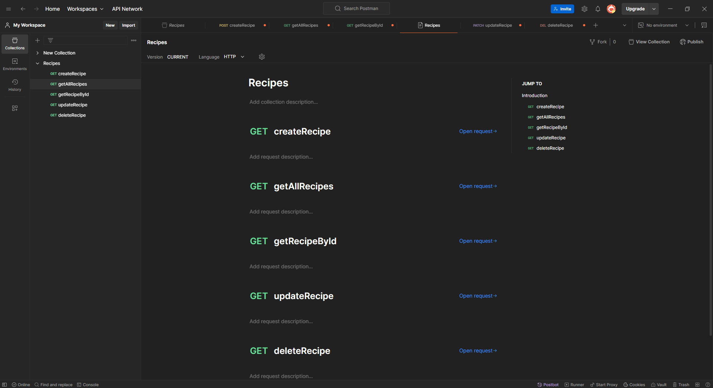

# Recipes App

This is a simple RECIPES API for managing recipes. The app allows users to perform CRUD (Create, Read, Update, Delete) operations on recipes. It uses Express.js for routing, MongoDB for data storage, and Mongoose for modeling the data.

## Features

- Create a new recipe
- Get all recipes
- Get a specific recipe by ID
- Update a recipe
- Delete a recipe

## Technologies Used

- **Node.js** - JavaScript runtime environment
- **Express.js** - Web framework for Node.js
- **MongoDB** - NoSQL database for storing recipe data
- **Mongoose** - ODM (Object Data Modeling) library for MongoDB
- **dotenv** - For managing environment variables
- **body-parser** - Middleware for parsing incoming request bodies


## Api url
```js
base_url = "https://task10-asw9.onrender.com/"

full_url = "https://task10-asw9.onrender.com/resipe"
```

## API Endpoint


1. Create a Recipe

* URL: /resipe
* Method: POST
* Body:
```js
{
  "name": "Recipe Name",
  "ingredients": ["Ingredient 1", "Ingredient 2"],
  "instructions": "Instructions for making the recipe",
  "price": 10.0
}

```
* Response:
  
```js
  {
  "message": "Create Recipe Successful"
  }
```

2. Get All Recipes
* URL: /resipe
* Method: GET
* Response: An array of all recipes in the database.

3. Get Recipe by ID
* URL: /resipe/:id
* Method: GET
* Response: The recipe with the specified ID.

4. Update a Recipe
* URL: /resipe/:id
* Method: PATCH
* Body:

```js
{
  "name": "Updated Recipe Name",
  "ingredients": ["Updated Ingredient 1", "Updated Ingredient 2"],
  "instructions": "Updated Instructions",
  "price": 15.0
}
```
* Response 
```js
{
  "message": "Update Recipe Successful"
}

```
5. Delete a Recipe
* URL: /resipe/:id
* Method: DELETE
* Response:
  
```js
{
  "message": "Delete Recipe Successful"
}
```


